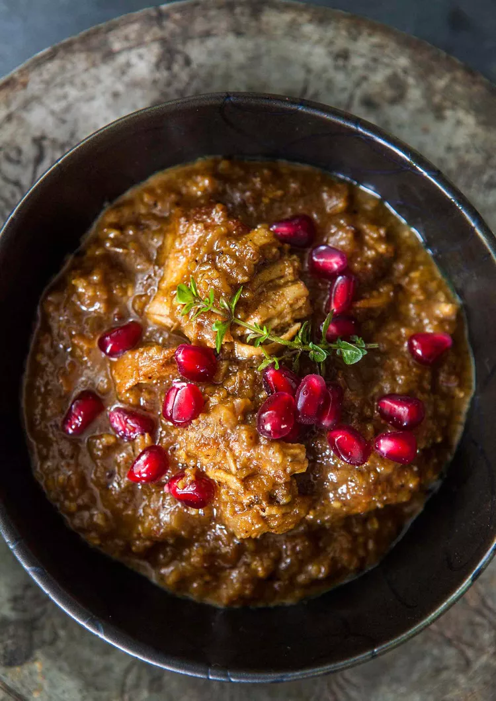

# Fesenjān Recipes 🍽️

A simple recipe page featuring Fesenjān, a beloved Iranian sweet-and-sour stew made with walnuts and pomegranate molasses.

This project was built as part of [The Odin Project](https://www.theodinproject.com/) Foundations curriculum.

## 🌐 Live Preview

[View the live website](https://mehrfrz.github.io/theOdinProjectRecipes/)

## 🛠️ Built With

- HTML5
- CSS3
- CSS Grid

## ✨ Features

- Semantic HTML structure
- Responsive recipe layout
- Two-column layout using CSS Grid
- Custom typography and styling
- Recipe ingredients and step-by-step directions
- Image and source attribution

## 📚 What I Learned

Through this project, I practiced:

- Structuring a webpage with HTML
- Using semantic HTML elements
- Linking an external CSS stylesheet
- Styling elements with CSS
- Using classes to target specific elements
- Working with CSS Grid
- Using pseudo-classes such as `:hover` and `:visited`
- Creating a clean and readable page layout
- Using Git and GitHub as part of the development workflow

## 📸 Preview

## 📖 Source

Recipe and image source:

[Simply Recipes – Fesenjan Persian Chicken Stew](https://www.simplyrecipes.com/recipes/fesenjan_persian_chicken_stew_with_walnut_and_pomegranate_sauce/)

## 🎓 Part of The Odin Project

This project was created while following the Foundations course from [The Odin Project](https://www.theodinproject.com/).

---

Built with ❤️ and a lot of Fesenjān cravings.
